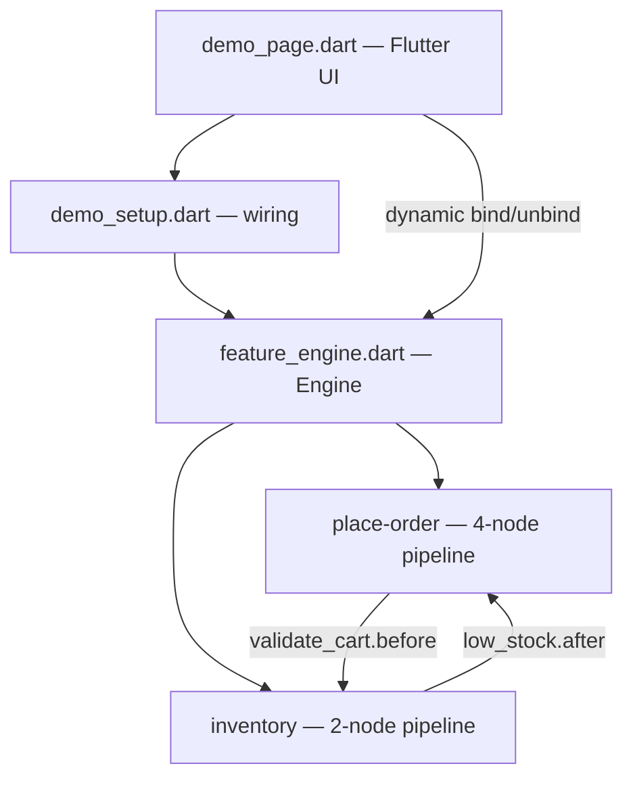

# architecture

How components connect and data flows through the system.

The system has three layers: a generic engine, concrete features, and a wiring layer that connects them.

**Engine** (`lib/feature_engine.dart`) is the generic runtime. It knows nothing about orders or inventory — it runs named pipelines of nodes and dispatches hooks. All domain logic lives in features.

**Features** (`lib/features/*/`) each define a pipeline of nodes registered on the engine. Features are peers — no feature imports another. They communicate exclusively through hooks on each other's nodes, mediated by the engine.

**Wiring** (`lib/demo_setup.dart`) is the only place that knows about multiple features simultaneously. It calls `engine.bind()` to wire static cross-feature hooks at startup. The function `buildDemoEngine()` returns a fully wired engine.

**UI** (`lib/demo_page.dart`) holds the engine instance, triggers `engine.run('feature-name', ctx)`, and manages dynamic hooks (holiday pricing, fraud, debug) via `engine.dynamicBind()` / `handle.unbind()`.

**Data flow**: callers create a `Context` (a `Map<String, dynamic>` wrapper), pass it to `engine.run()`. Each node reads/writes context keys. Hooks fire before/after each node and can read, write, or abort the context. After execution, the caller reads results from the same context object.
