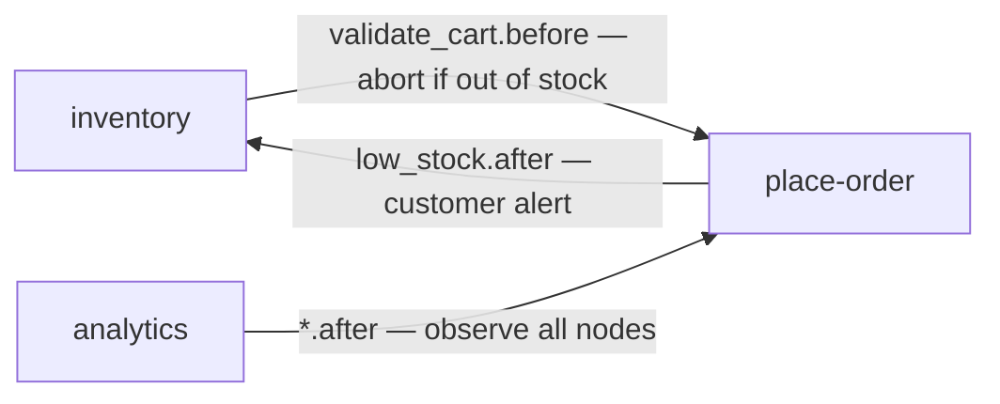

# hook-wiring

How features connect to each other through static and dynamic hooks.

**Static hooks** are wired at startup in `lib/demo_setup.dart` via `engine.bind()`. They live for the lifetime of the engine and cannot be removed. Three are wired:

**Dynamic hooks** are bound/unbound at runtime via `engine.dynamicBind()` which returns a `HookHandle`. The UI toggles three:

- **holiday_pricing** → `place-order.calculate_totals.before` — injects a $5 discount into `ctx['discounts']`
- **fraud** → `place-order.charge_payment.before` — bound per-request only for high-risk customers (`ctx['customer_risk'] == 'high'`), unbound immediately after the run
- **debug** → `place-order.*.before` — wildcard observer on all nodes

**Hook execution order**: hooks fire in registration order. For a node with both static and dynamic hooks, static hooks run first (they were registered first).

**Short-circuit**: any before hook can call `ctx.abort(reason)`. This stops the current node's action and all remaining nodes. The abort point is recorded in `ctx.abortedAt`.

**Wildcard targeting**: `"feature.*"` attaches the hook to every node in that feature. Used by analytics (after) and debug (before).

**Per-request pattern**: the fraud hook demonstrates binding a hook for a single `engine.run()` call, then immediately unbinding via `handle.unbind()`. This avoids polluting other requests.
